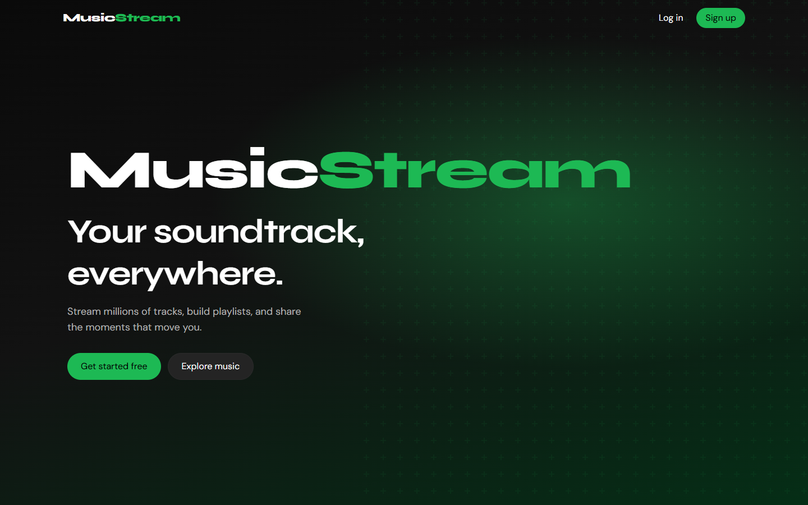
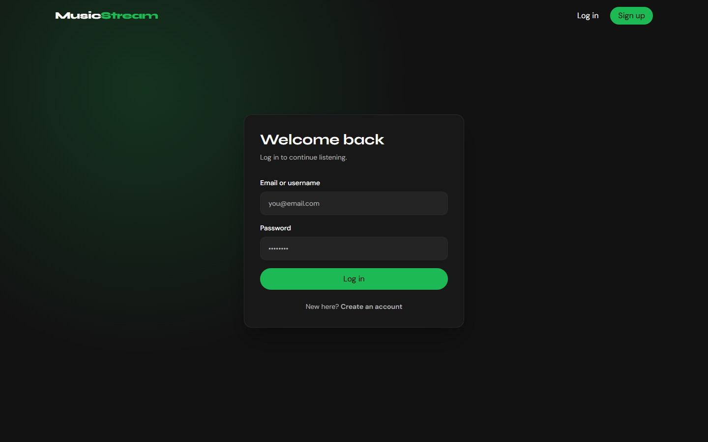
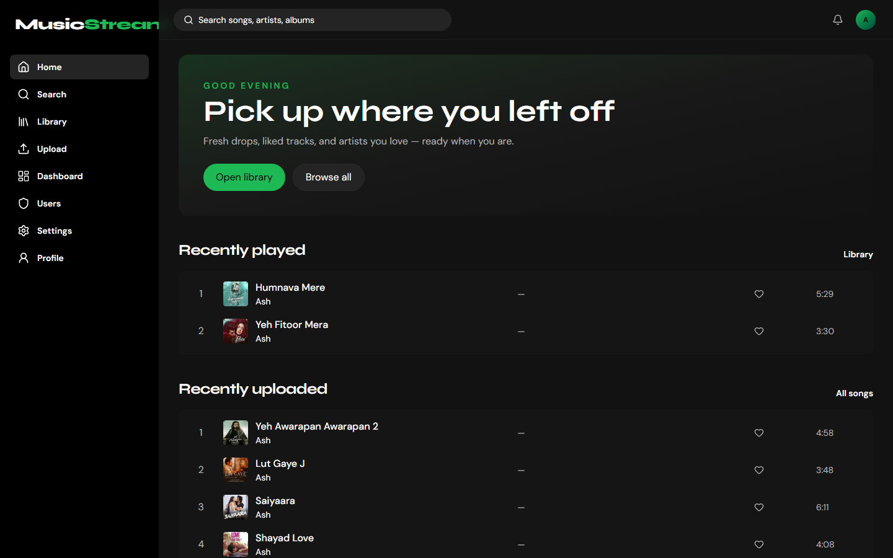
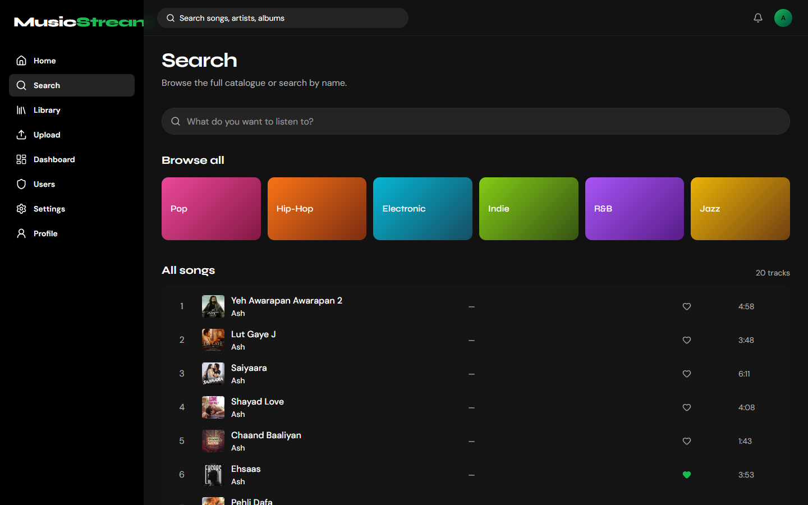
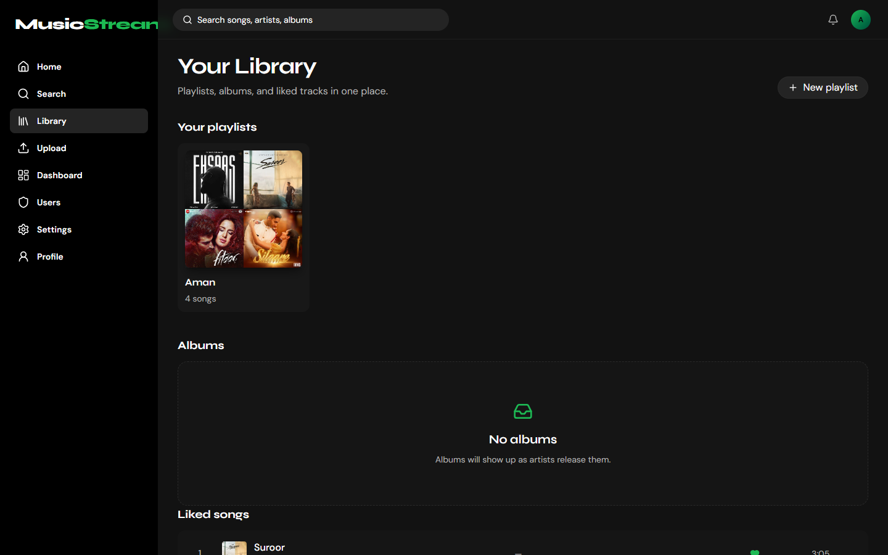
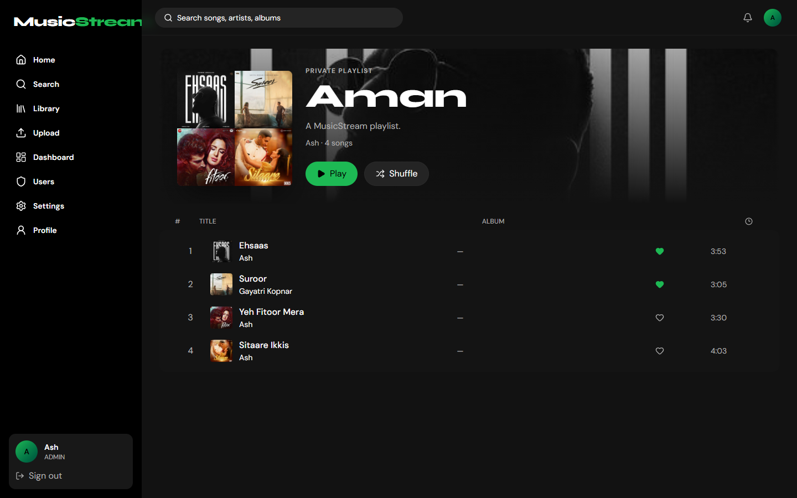
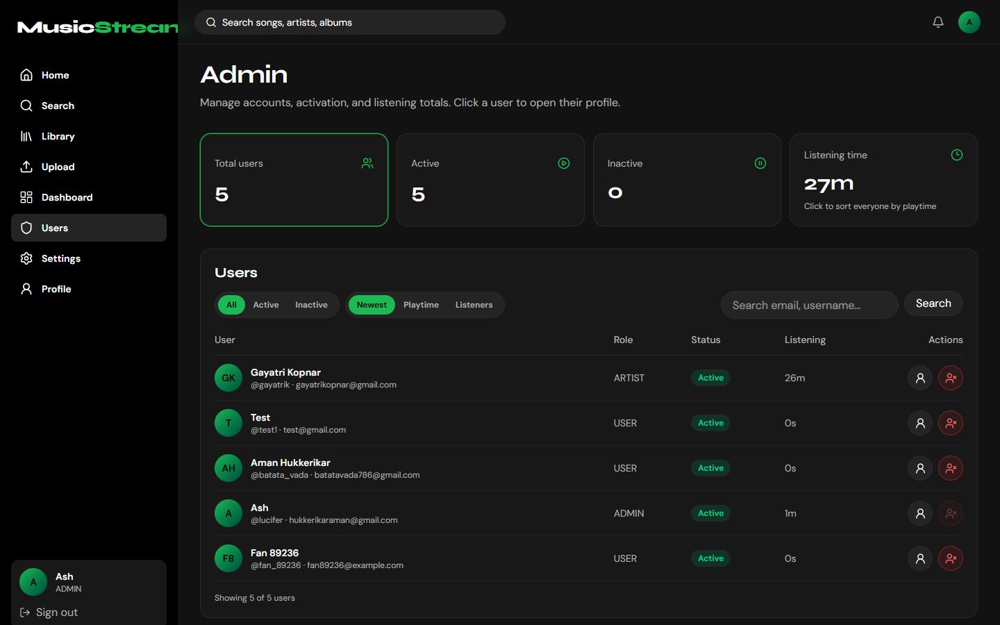
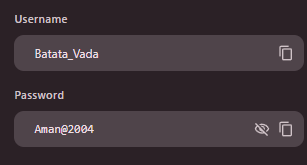
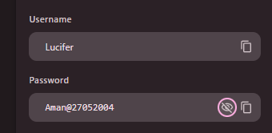

# MusicStream

Spotify-style music streaming app built with **FastAPI** + **React (Vite)**.

Upload tracks as an artist, share one link with friends, and let them listen — with private playlists, likes, real listening-time tracking, and an admin panel.

**Live frontend:** [music-stream-eight-zeta.vercel.app](https://music-stream-eight-zeta.vercel.app)  
**API:** [musicstream-x01y.onrender.com](https://musicstream-x01y.onrender.com)  
**Deploy walkthrough:** [DEPLOY_WALKTHROUGH.md](./DEPLOY_WALKTHROUGH.md)

---

## Screenshots

Captured in **Google Chrome** at **1440×900**.

### Landing



### Login



### Home



### Search & browse



### Library & playlists



### Playlist detail (collage cover)



### Admin — users & listening time



---

## Demo logins

Use these accounts to try the live site (for friends / reviewers).

| Role | Username | Password | Notes |
|------|----------|----------|--------|
| **Listener** | `Batata_Vada` | `Aman@2004` | Normal user — listen, like, playlists |
| **Admin** | `Lucifer` | `Aman@27052004` | Admin panel, upload, manage users |

<details>
<summary>Credential screenshots</summary>

**Listener — Batata_Vada**



**Admin — Lucifer**



</details>

> Prefer registering your own **Listener** account if you only want to stream.

---

## Features

- Stream songs with a full player (shuffle, repeat, queue, now-playing card)
- Like songs and keep a private library
- Create **private** playlists (isolated per user) with collage covers, remove, and drag-reorder
- Artist upload (audio + cover) via Supabase Storage
- Real listening-time tracking (partial plays count correctly)
- Admin: activate / deactivate users, sort by playtime, open user profiles & most-played songs
- Responsive UI for phone, tablet, laptop, and ultrawide

---

## Stack

| Layer | Tech |
|-------|------|
| Frontend | React, Vite, TypeScript, Tailwind, TanStack Query, Zustand |
| Backend | FastAPI, SQLAlchemy (async), Alembic, Pydantic |
| Auth | JWT access + refresh tokens |
| Database | PostgreSQL (Supabase) |
| Files | Supabase Storage (`songs`, `covers`, `avatars`) |
| Hosting | Vercel (UI) + Render (API) |

---

## Local development

### Backend

```bash
cd backend
python -m venv .venv
# Windows
.\.venv\Scripts\activate
pip install -r requirements.txt
copy .env.example .env
# Fill DATABASE_URL, JWT_SECRET_KEY, SUPABASE_* …
alembic upgrade head
uvicorn app.main:app --reload
```

API docs: http://127.0.0.1:8000/docs

### Frontend

```bash
cd frontend
npm install
copy .env.example .env
# VITE_API_URL=http://127.0.0.1:8000/api/v1
npm run dev
```

App: http://localhost:5173

### Recapture README screenshots (Chrome)

With the frontend running locally:

```bash
npm install --no-save puppeteer-core
node scripts/capture-readme-screenshots.mjs
```

Screenshots land in `docs/screenshots/` (1440×900).

---

## Roles

| Who | Role | Can do |
|-----|------|--------|
| Friends | Listener / USER | Listen, like, private playlists |
| You | ARTIST | Upload + listen |
| You | ADMIN | Users panel, activate/deactivate, listening totals |

---

## Project layout

```
MusicStream/
├── backend/                 # FastAPI API + Alembic migrations
├── frontend/                # React (Vite) app
├── docs/screenshots/        # README images (Chrome captures)
├── scripts/                 # Helper scripts (screenshot capture, etc.)
├── DEPLOY_WALKTHROUGH.md
└── README.md
```

Never commit real `.env` files — only `.env.example`.

---

## Free production deploy (short)

1. **Supabase** — Postgres + public Storage buckets `songs`, `covers`, `avatars`
2. **Render** — deploy `backend/` with `DATABASE_URL`, JWT, Supabase keys, `CORS_ORIGINS`
3. **Vercel** — deploy `frontend/` with `VITE_API_URL=https://YOUR-API.onrender.com/api/v1`
4. Point Render `CORS_ORIGINS` at the exact Vercel URL and redeploy

Full steps: [DEPLOY_WALKTHROUGH.md](./DEPLOY_WALKTHROUGH.md)

---

## Troubleshooting

| Problem | Fix |
|---------|-----|
| Songs load but no sound | Public Supabase buckets; re-upload after storage is configured |
| CORS / network errors | Match `CORS_ORIGINS` to the Vercel URL exactly |
| First load very slow | Render free tier cold start — wait ~30–60s and refresh |
| Login fails in prod | Check `DATABASE_URL` + `JWT_SECRET_KEY` on Render |
| Someone sees your playlist | Playlists are private; hard-refresh after latest deploy |

---

## License

Personal / educational project — share the Vercel link with a few friends for listening.
